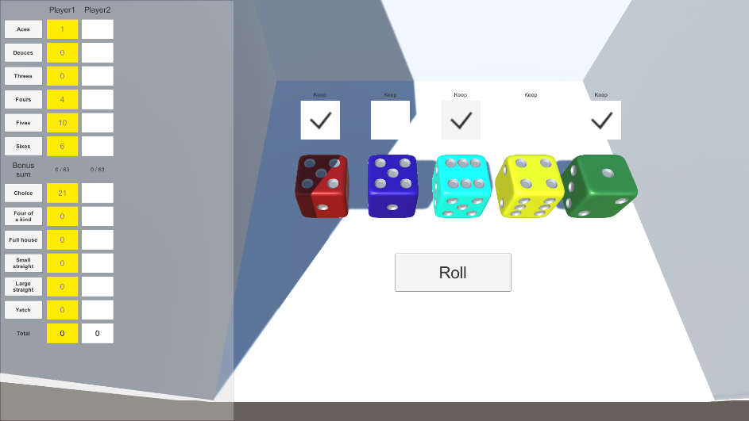

# YachuDice
주사위 게임 요트(Yacht)를 구현한 것입니다.\
{: height="250"}\
이 프로젝트는 친구들 사이에 51 Worldwide Games의 Yacht Dice가 유행하던 시기에 간단하게 구현해 본 것을 정리하여 업로드한 것입니다.

## 상세 설명
[UniTask](https://github.com/Cysharp/UniTask)를 중점적으로 사용하여 구현하였습니다.\
3D 모델링된 주사위를 던지고 결과를 확인하도록 구현하였습니다.
주사위의 윗면을 선정하는 데에는 다음과 같은 방법을 사용했습니다.
 1. 각 면의 가운데에 빈 GameObject를 추가합니다.
 2. 그렇게 추가한 6개의 GameObject 중 가장 Y 좌표 값이 큰 것을 선택하면 어떤 면이 윗면인지 알 수 있습니다.
 
족보 검사 메서드는 ChatGPT가 초안을 작성했습니다.

## 기타 사항
.editorconfig 파일에는 제가 선호하는 코드 서식이 지정되어 있습니다.

## ToDo 리스트
 - BGM 재생에 MusicStack 프로젝트 사용하기.
 - 선수 이름 및 인원 수 지정.
 - 주사위를 다시 굴릴 때, 다시 굴린 주사위들이 홀드해둔 주사위들에 부딪혀 움직임이 덜 즐거운 문제를 해결.
 - 코드 정리 및 주석 추가.
 - 주사위를 던지는 더 재미있는 방법을 생각하기.
 - 족보 달성 시 화려한 UI를 표시하여 더 신나게 하기.
 - 프로토타입 같은 UI 를 개선하기.
 - 게임이 끝난 후 다시 시작하는 흐름 만들기.
 - PC 버전 빌드.
 - 컨트롤러 지원.

## 사용된 오픈소스 라이센스(축복 받으세요.)
Dice by TheBoss009SS -- https://sketchfab.com/3d-models/dice-d796ac8f56db4dc78ed18be534939225 -- License: Attribution 4.0  
Plastic lid snap.wav by SDLx -- https://freesound.org/s/211171/ -- License: Attribution 3.0  
Background Music by Migfus20 -- https://freesound.org/s/609562/ -- License: Attribution 4.0  
UniTask by Cysharp -- https://github.com/Cysharp/UniTask -- License: MIT  
UniRx by neuecc -- https://github.com/neuecc/UniRx -- License: MIT  